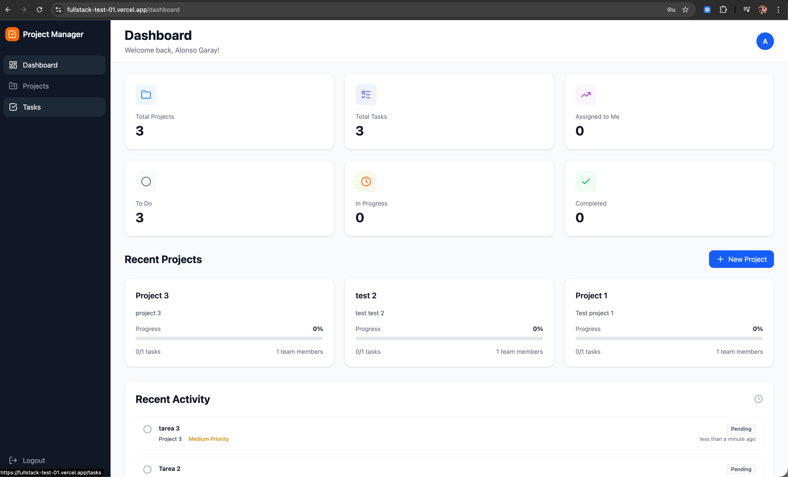
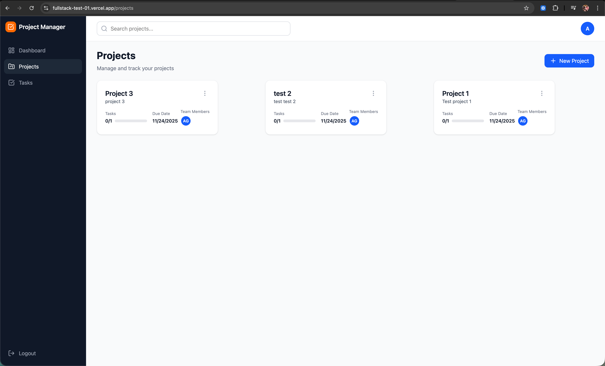
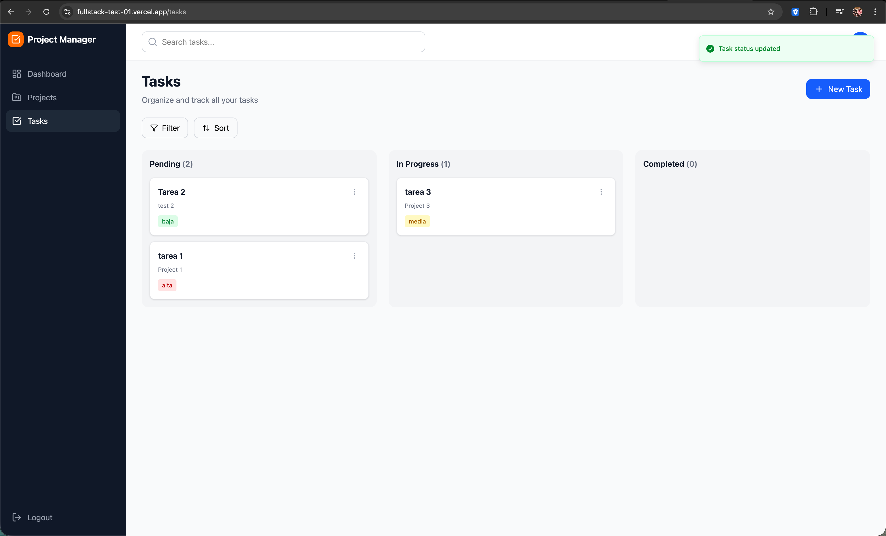

# Decisiones Técnicas
## Alonso Garay

---

## 📋 Información General

- **Nombre del Candidato**: Alonso Joaquin Garay Patrón
- **Fecha de Inicio**: 21/11/2025
- **Fecha de Entrega**: 24/11/2025
- **Tiempo Dedicado**: ~30 horas

---

## 🛠️ Stack Tecnológico Elegido

### Backend

| Tecnología | Versión | Razón de Elección |
|------------|---------|-------------------|
| Node.js | 22.x | Es la última versión LTS, aparte de que cuenta con mejor rendimiento, también cuenta con soporte de características modernas de JavaScript/TypeScript |
| TypeScript | 5.x | Tipado estático para prevenir errores en tiempo de desarrollo y mejor autocompletado |
| Express | 4.x | Framework minimalista y flexible, ampliamente adoptado con gran ecosistema |
| MongoDB | 7.x | Base de datos NoSQL ideal para estructura flexible de proyectos y tareas, mejor escalabilidad horizontal |
| Mongoose | 8.x | ODM robusto con validación integrada y middleware pre/post hooks |
| Zod | 3.x | Validación type-safe con inferencia automática de tipos TypeScript |
| Jest | 29.x | Framework de testing completo con buen soporte para TypeScript y mocking integrado |
| Bcrypt | 5.x | Librería madura y segura para hash de contraseñas |

### Frontend

| Tecnología | Versión | Razón de Elección |
|------------|---------|-------------------|
| React | 19.x | Librería UI más popular con excelente ecosistema y rendimiento con Concurrent Features. Aparte cuenta con React Compiler para optimización sin necesidad de forzar el tipado manual |
| TypeScript | 5.x | Consistencia con backend, type-safety en componentes y props |
| Vite | 5.x | Build tool extremadamente rápido con HMR instantáneo |
| Zustand | 4.x | State management minimalista, más simple y ligero que Redux|
| React Query | 5.x | Manejo declarativo de estado del servidor con caching, sincronización y refetch automático |
| React Hook Form | 7.x | Manejo de formularios performante con validación integrada y menos re-renders |
| TailwindCSS | 3.x | Utility-first CSS para desarrollo rápido y diseño consistente |
| Shadcn/ui | Latest | Componentes headless reutilizables con accesibilidad built-in |
| Sonner | 1.x | Toast notifications elegantes y ligeras, mejor UX que react-toastify |

---

## 🏗️ Arquitectura

### Estructura del Backend

```
backend/
├── src/
│   ├── config/          # Configuración de DB, validación de env vars
│   ├── controllers/     # Lógica de manejo de requests
│   ├── middlewares/     # Auth, validación, error handling
│   ├── models/          # Schemas de Mongoose
│   ├── routes/          # Definición de endpoints
│   ├── schemas/         # Validación con Zod
│   ├── services/        # Lógica de negocio
│   ├── utils/           # Funciones helper (JWT, etc)
│   ├── app.ts           # Configuración de la aplicación
│   └── server.ts        # Entry point
├── tests/               # Tests unitarios e integración
└── dist/                # Compilado TypeScript
```

**Razón de esta estructura:**
- **Separación de responsabilidades**: Controllers manejan HTTP, services contienen lógica de negocio
- **Reutilización**: Services pueden ser usados por múltiples controllers
- **Testabilidad**: Lógica de negocio aislada es más fácil de testear
- **Escalabilidad**: Fácil agregar nuevos features sin modificar código existente
- **Layered Architecture**: Capas bien definidas (routes → controllers → services → models). Mezcla entre Clean Architecture y MVC Architecture

### Estructura del Frontend

```
frontend/
├── src/
│   ├── api/             # Cliente API HTTP con axios
│   ├── components/      # Componentes React organizados por feature
│   │   ├── common/      # Componentes reutilizables
│   │   ├── dashboard/   # Componentes específicos del dashboard
│   │   ├── layout/      # Componentes específicos del layout
│   │   ├── project/     # Componentes específicos de Gestión de proyectos
│   │   ├── routes/      # Configuración de routing
│   │   ├── task/        # Componentes específicos de Gestión de tareas
│   │   ├── ui/          # Componentes base de Shadcn
│   │   └── user/        # Componentes específicos de Gestión de usuarios
│   ├── hooks/           # Custom hooks para data fetching
│   ├── lib/             # Utilidades
│   ├── pages/           # Páginas de la aplicación
│   ├── schemas/         # Validación con Zod
│   ├── store/           # Estado global con Zustand
│   └── types/           # Definiciones TypeScript
└── dist/                # Build de producción
```

**Razón de esta estructura:**
- **Feature-based organization**: Componentes agrupados por funcionalidad (project, task, etc.)
- **Colocation**: Lógica relacionada está cerca (components + hooks + schemas)
- **Reutilización**: Componentes comunes separados de específicos
- **Mantenibilidad**: Fácil encontrar y modificar features específicos
- **Escalabilidad**: Estructura que soporta crecimiento del proyecto

---

## 🗄️ Diseño de Base de Datos

### Elección: MongoDB

**Razones:**
1. **Flexibilidad del schema**: Las tareas pueden tener campos variables según el proyecto
2. **Documentos embebidos**: Fácil almacenar arrays de collaborators y tasks sin joins
3. **Escalabilidad horizontal**: Sharding nativo para futuros crecimientos
4. **JSON nativo**: Comunicación directa con frontend sin transformaciones
5. **Desarrollo ágil**: Cambios de schema sin migraciones complejas

### Modelos

#### User
```typescript
{
  name: String,
  email: String (unique, indexed),
  password: String (hashed con bcrypt),
  createdAt: Date,
  updatedAt: Date
}
```

#### Project
```typescript
{
  name: String,
  description: String,
  owner: ObjectId (ref: User, indexed),
  collaborators: [ObjectId] (ref: User),
  createdAt: Date,
  updatedAt: Date
}
```

#### Task
```typescript
{
  title: String,
  description: String,
  project: ObjectId (ref: User, indexed),
  assignedTo: ObjectId (ref: User, indexed),
  status: Enum ['pendiente', 'en progreso', 'completada'],
  priority: Enum ['baja', 'media', 'alta'],
  createdAt: Date,
  updatedAt: Date
}
```

**Decisiones importantes:**
- **Índices compuestos**: `project + status` para queries rápidas de dashboard
- **Índices únicos**: `email` en User para prevenir duplicados
- **Validación en modelo**: Schema validation en Mongoose + validación adicional con Zod en controllers

---

## 🔐 Seguridad

### Implementaciones de Seguridad

- [✅] **Hash de contraseñas**: Bcrypt con salt rounds = 10. Elegí bcrypt por su resistencia a ataques GPU y es la mas usada en la industria
- [✅] **JWT**: Tokens con expiración de 7 días, firmados con secret de 256 bits.
- [✅] **Validación de inputs**: Zod en controllers + Mongoose schema validation como segunda capa
- [✅] **CORS**: Configurado para permitir solo origen específico del frontend, no wildcard
- [✅] **Headers de seguridad**: Helmet.js para headers HTTP seguros (X-Frame-Options, CSP, etc.)
- [✅] **Rate limiting**: Express-rate-limit con 5 intentos/15min en auth, 100 req/15min en API general

### Consideraciones Adicionales

- **Sanitización de datos**: Mongoose escapa caracteres especiales en queries
- **SQL/NoSQL Injection**: Validación de tipos previene inyección de código
- **XSS Prevention**: React escapa output automáticamente
- **Error handling**: Mensajes genéricos al cliente, detalles solo en logs

### Vulnerabilidades Consideradas

- ❌ **Refresh tokens**: No implementados por tiempo de entrega - mejora futura
- ❌ **Two-factor auth**: No implementado - mejora futura
- ❌ **Audit logs**: No implementados - mejora futura
- ❌ **Tests exhaustivos**: Cobertura limitada de tests - mejora futura con mayor coverage
- ❌ **CI/CD robusto**: Pipeline básico - mejora futura con tests automáticos, coverage reports, y deployment automático

---

## 🎨 Decisiones de UI/UX

### Framework/Librería de UI

**Elegí**: TailwindCSS + Shadcn/ui

**Razón**: 
- TailwindCSS permite desarrollo rápido con utilidades CSS sin escribir CSS custom
- Shadcn/ui provee componentes accesibles y customizables que copio al proyecto (no como librería)
- Combinación da control total sobre estilos + componentes base robustos

### Patrones de Diseño

- **Responsive Design**: Mobile-first con breakpoints de Tailwind (sm, md, lg, xl)
- **Loading States**: 
  - Spinners centralizados para queries
  - Disabled states en botones durante mutations
- **Error Handling**: 
  - Toast notifications (Sonner) para errores de API
  - Mensajes inline para errores de validación de formulario
  - Páginas 404 para rutas no encontradas
- **Feedback Visual**: 
  - Toasts posición top-right con rich colors
  - Confirmaciones con AlertDialog para acciones destructivas
  - Transiciones suaves con Tailwind transitions

### Decisiones de UX

1. **Kanban sencillo sin drag & drop**: Decidí no implementar DnD por tiempo de entrega. Los usuarios cambian status con dropdown, más simple pero funcional

2. **Dashboard con estadísticas visuales**: StatCards muestran métricas clave (total de proyectos, tareas por status, asignadas a mí). Uso iconos de Lucide para mejor escaneabilidad

3. **Búsqueda en tiempo real**: SearchBar filtra instantáneamente sin necesidad de "submit", mejor UX

4. **Confirmación de eliminación**: AlertDialog previene eliminaciones accidentales de proyectos

5. **Toast notifications sobre inline errors**: Menos intrusivo, no bloquea UI, auto-dismiss

6. **User profile dropdown**: Acceso rápido a Settings y Logout desde cualquier página

---

## 🧪 Testing

### Estrategia de Testing

**Backend:**
- [Tipo de tests que escribiste]
- [¿Por qué elegiste probar estos endpoints/funciones específicamente?]
- [Herramientas usadas]

**Frontend:**
- [Tipo de tests que escribiste]
- [¿Qué componentes decidiste probar y por qué?]
- [Herramientas usadas]

### Cobertura

- **Backend**: [X%]
- **Frontend**: [X%]

**Decisión**: Prioricé funcionalidad completa sobre cobertura de tests por tiempo de entrega. En producción real apuntaría a >80% backend, >70% frontend.

---

## 🐳 Docker

### Implementación

- ✅ Dockerfile backend con multi-stage build
- ✅ Dockerfile frontend con multi-stage build (Node → Nginx)
- ✅ docker-compose.yml con 3 servicios (mongo, backend, frontend)

**Decisiones:**

1. **Alpine Linux como base**: 
   - Imágenes ~5x más pequeñas
   - Suficiente para Node.js

2. **Multi-stage builds**: 
   - Stage 1: Build con dev dependencies
   - Stage 2: Runtime con solo prod dependencies
   - Reduce tamaño final

3. **Nginx para frontend**:
   - Mejor rendimiento que `serve`
   - Configuración custom para SPA routing
   - Headers de seguridad

4. **Optimizaciones**:
   - npm cache clean after install
   - .dockerignore para excluir node_modules, .git
   - COPY order optimizado para layer caching

---

## ⚡ Optimizaciones

### Backend

1. **Índices de MongoDB**: 
   - Email indexado unique para búsquedas mas rápidas
   - project + status compuesto para dashboard queries

2. **Populate selectivo**:
   - Solo traigo campos necesarios: `.populate('owner', 'name email')`
   - Reduce payload size

3. **Connection pooling**:
   - Mongoose maneja pool automáticamente
   - maxPoolSize no configurado (usa default)

### Frontend

1. **React Query caching**:
   - Cache de 5min para projects/tasks
   - Reduce llamadas API repetidas

2. **Memoización selectiva**:
   - useMemo/useCallback no son tan necesarios por React Compiler en React 19.x

3. **Image optimization**:
   - Sin imágenes pesadas en este MVP
   - Iconos como SVG (Lucide React)

---

## 🚧 Desafíos y Soluciones

### Desafío 1: Docker Build Falla por package-lock.json

**Problema:**
npm ci requiere package-lock.json pero .gitignore lo excluía, causando fallos en CI/CD.

**Solución:**
Cambié `npm ci` a `npm install` en Dockerfile. Alternativa: remover package-lock de .gitignore.

**Aprendizaje:**
.dockerignore y .gitignore tienen diferentes propósitos. Package-lock debería commitearse para reproducibilidad.

### Desafío 2: CORS Errors en Producción

**Problema:**
Frontend en Vercel no podía comunicarse con backend en Render por CORS.

**Solución:**
Configuré CORS_ORIGIN environment variable con URL exacta del frontend. No usar wildcard en producción.

**Aprendizaje:**
Environment variables deben ser específicas por ambiente (dev vs prod). Usar .env.example como template.

---

## 🎯 Trade-offs

### Trade-off 1: MongoDB vs MySQL

**Opciones consideradas:**
- **MongoDB**: Schema flexible, escalabilidad horizontal, JSON nativo
- **MySQL**: Relaciones claras, familiaridad

**Elegí**: MongoDB

**Razón:**
Prioricé velocidad de desarrollo y flexibilidad sobre consistencia fuerte. Las tareas pueden evolucionar con campos custom. Sacrifiqué joins eficientes pero gané agilidad. Para MVP está bien; en producción evaluaría hybrid approach.

### Trade-off 2: Zustand vs Redux

**Opciones consideradas:**
- **Redux**: Ecosistema maduro, DevTools, time-travel debugging
- **Zustand**: Minimal boilerplate, mejor DX, más simple

**Elegí**: Zustand

**Razón:**
Prioricé simplicidad y velocidad de desarrollo. Redux es overkill para este scope. Zustand da store global sin ceremony. Sacrifiqué Redux DevTools pero gané productividad.

### Trade-off 3: Toast Notifications vs Inline Errors

**Opciones consideradas:**
- **Toast**: No intrusivo, auto-dismiss, consistente
- **Inline**: Junto al elemento, no se pierden

**Elegí**: Toast (Sonner)

**Razón:**
Mejor UX general. Los errores no bloquean UI. Usuario puede continuar trabajando. Sacrifiqué persistencia (se auto-descartan) pero gané fluidez.

---

## 🔮 Mejoras Futuras

Si tuviera más tiempo, implementaría:

1. **Refresh Tokens**
   - Descripción: JWT de corta duración + refresh token en httpOnly cookie
   - Beneficio: Mejor seguridad sin sacrificar UX

2. **Drag & Drop en Kanban**
   - Descripción: React DnD o dnd-kit para reordenar tareas
   - Beneficio: UX superior, más intuitivo

3. **Real-time Updates con WebSockets**
   - Descripción: Socket.io para updates colaborativos en tiempo real
   - Beneficio: Múltiples usuarios ven cambios instantáneamente

4. **Filtros Avanzados**
   - Descripción: Filtrar por fecha, múltiples proyectos, rango de prioridad
   - Beneficio: Mejor navegación en proyectos grandes

5. **Notificaciones Push**
   - Descripción: Service workers para notificaciones de asignaciones
   - Beneficio: Users al tanto de nuevas tareas sin abrir app

6. **Attachments en Tareas**
   - Descripción: Upload de archivos con AWS S3/Cloudinary
   - Beneficio: Contexto rico para tareas

7. **Comentarios en Tareas**
   - Descripción: Thread de discusión por tarea
   - Beneficio: Colaboración mejorada

8. **Analytics Dashboard**
   - Descripción: Charts con recharts (velocity, burndown, etc.)
   - Beneficio: Métricas de equipo y tendencias

9. **Email Notifications**
   - Descripción: SendGrid/Resend para notificaciones por email
   - Beneficio: Users informados sin estar en app

10. **Tests Unitarios**
    - Descripción: Implementar tests unitarios con Jest
    - Beneficio: Confianza en código y deploys

11. **Tests End-to-End**
    - Descripción: Playwright para user flows críticos
    - Beneficio: Confianza en deploys

---

## 📚 Recursos Consultados

Durante el desarrollo consulté:

- [Documentación oficial de MongoDB](https://www.mongodb.com/docs/)
- [React Query Best Practices](https://tanstack.com/query/v5/docs/framework/react/overview)
- [Zustand Documentation](https://docs.pmnd.rs/zustand/getting-started/introduction)
- [Express.js Security Best Practices](https://expressjs.com/en/advanced/best-practice-security.html)
- [Shadcn/ui Components](https://ui.shadcn.com/)
- [Docker Multi-stage Builds](https://docs.docker.com/build/building/multi-stage/)
- [GitHub Actions Documentation](https://docs.github.com/en/actions)
- [JWT Best Practices](https://medium.com/@diego.coder/autenticaci%C3%B3n-en-node-js-con-json-web-tokens-y-express-ed9d90c5b579)

---

## 🤔 Reflexión Final

### ¿Qué salió bien?

1. **Arquitectura por capas**: Separación de responsabilidades clara facilitó debugging y extensión
2. **TypeScript end-to-end**: Type safety previno innumerables bugs en desarrollo
3. **Docker setup**: Deployment reproducible
4. **React Query integration**: Data fetching declarativo
5. **Toast notifications**: UX consistente y no intrusiva
6. **CI/CD pipeline**: Simple pero efectivo, valida cada push
7. **Zustand**: Mas ligero, flexible y rapido que Redux
8. **JWT Auth**: Json web tokens para autenticacion

### ¿Qué mejorarías?

1. **Test coverage**: Definitivamente necesita tests, especialmente e2e
2. **Error handling**: Más granular, diferentes errors para diferentes casos
3. **Loading states**: Algunos componentes no muestran loading, UX inconsistente. Skeleton loading
4. **Validation messages**: Más descriptivos, algunos son genéricos
5. **Code comments**: Poca documentación inline, dificulta onboarding
6. **Performance monitoring**: Sin métricas, no sé si hay bottlenecks reales
7. **Projects listing**: Haria una tabla con paginacion y mejor UI/UX.

### ¿Qué aprendiste?

1. **Docker Compose**: Orquestación de múltiples servicios (MongoDB, backend, frontend) con networking automático
2. **Docker multi-stage builds**: Reducción de tamaño de imagen impresionante con separación de build y runtime
3. **GitHub Actions CI/CD**: Pipeline de integración continua más simple de lo esperado para validación automática
4. **Zod schema validation**: Validación type-safe con inferencia de tipos, mejor DX que otras librerías
5. **Zustand (reforzado)**: Consolidé conocimientos de state management minimalista sin boilerplate
6. **React Query (reforzado)**: Reforcé patrones de caching, invalidación de queries y optimistic updates
7. **Nginx**: Configuración de proxy y seguridad

---

## 📸 Capturas de Pantalla

### Login

*Autenticación con validación en tiempo real y mensajes de error claros*

### Dashboard

*Vista general con estadísticas de proyectos y tareas, activity overview con tareas recientes*

### Lista de Proyectos

*Gestión de proyectos con búsqueda, creación rápida, y team management*

### Kanban de Tareas

*Board tipo Kanban con filtros por proyecto, prioridad, y búsqueda. Incluye creación de tareas inline*

---

**Fecha de última actualización**: 25/11/2025
